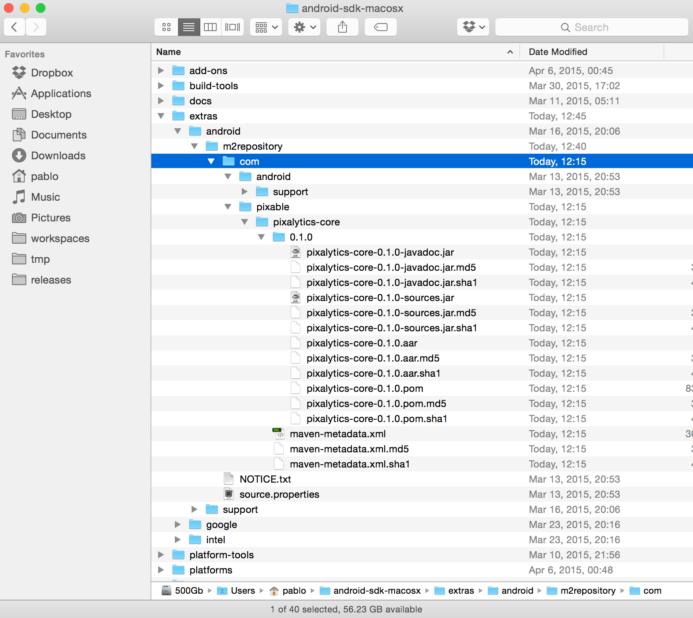

Pixalytics is an Android client API to send events to the top Analytics platforms, such as Mixpanel, Google Analytics or Flurry.

Well, rather, it will be. It is now under development, so it is *not* recommended that you use it just yet.

How to import locally
---------------------

First, generate the Maven artifacts for every `pixalytics-*` module. For instance, `cd pixalytics-core && ../gradlew clean build generateRelease`.

Now, move the generated files into your local Maven repository: .

And now you can import the dependency as you normally would: `compile 'com.pixable:pixalytics-core:0.1.0'`.
